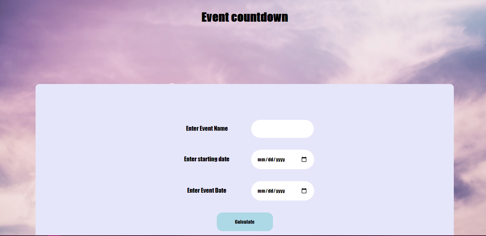

#Event counter

Event counter counts how many days there is from start date to end date and prints it with the event name on the screen.
This was a school project for learning purposes.

Technologies used
Built with:

HTML
JS
CSS

Setup and usage
https://public.bc.fi/s2100154/EventCounter/

Screenshot

Sources
https://source.unsplash.com/8P-uQaTd8rw/1600x900
[Unsplash](https://source.unsplash.com/8P-uQaTd8rw/1600x900)

Authors and acknowledgment
Author: Emilia Vuorenmaa
GitHub: @emilia_jenni
Acknowledgement:
Margit Tennosaar
