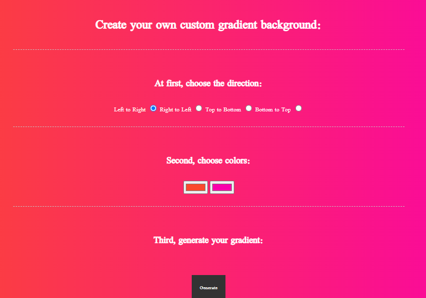

#Gradient Background Generator

The aim was to make a generator for gradient backgrounds.
This was a school project for learning purposes.

Technologies used
Built with:

HTML
JS
CSS

Setup and usage
https://public.bc.fi/s2100154/BG_generator/

Screenshot

Authors and acknowledgment
Author: Emilia Vuorenmaa
GitHub: @emilia_jenni
Acknowledgement:
Margit Tennosaar
