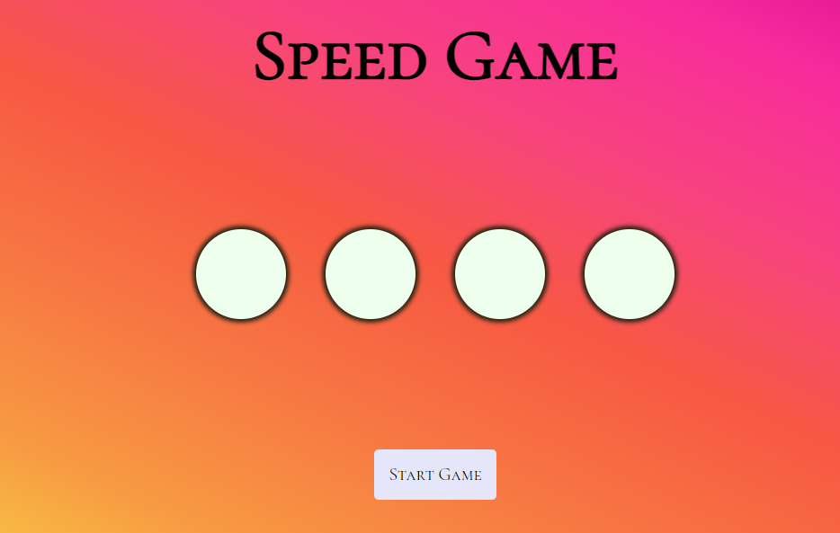

#Speden Spelit Speed Game
The aim of this was to make a speed game inspired by the legendary Finnish Speden Spelit program. Here we practiced adding sound to the game also.
This was a school project for learning purposes.

Technologies used
Built with:

HTML
JS
CSS

Setup and usage
https://public.bc.fi/s2100154/SpeedGameSpedenSpelit/

Screenshot

Sources
https://downloads.khinsider.com/[Arcade Music Library] (https://downloads.khinsider.com/)
Authors and acknowledgment
Author: Emilia Vuorenmaa
GitHub: @emilia_jenni
Acknowledgement:
Margit Tennosaar
