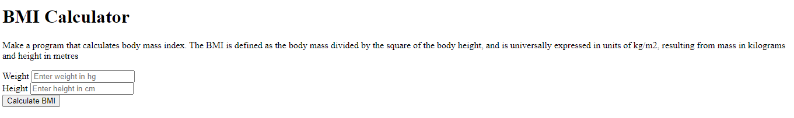
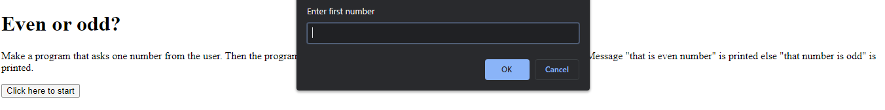
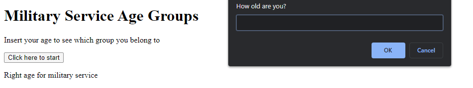
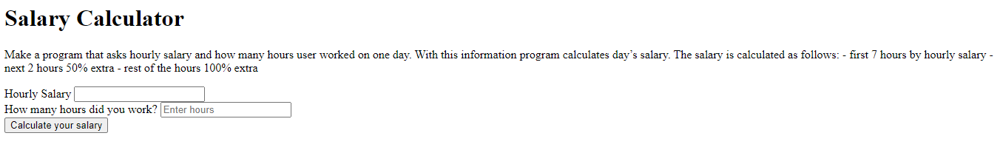
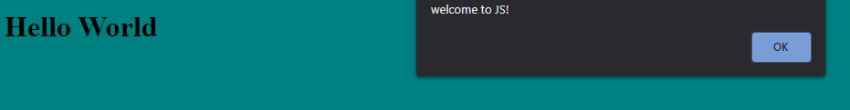

# Tasks 1-7

1.  Introduction to JavaScript
2.  Three positive numbers - Make a program that asks three numbers from the user. Program prints out sum of the numbers, if any of the numbers is positive. If all the numbers are positive, also print out multiplication. If all numbers are negative, text "only negatives" is printed. Handle zero as positive in this assignment.
3.  Military age - Make a program that asks age of the user. If the age is less than 18 the text "too young" is printed. If the age is less than 27 the text "Right age for military service" is printed. If the age is less than 41 the text "You are in reserve" is printed. If the age is less than 55 the text "You are in backup reserve" is printed. All other cases "too aged" is printed.
4.  Even/Odd number - Make a program that asks one number from the user. Then the program finds out if the number is positive and is the number divisible by 2. Message "that is even number" is printed else "that number is odd" is printed.
5.  Salary Calculator - Make a program that asks hourly salary and how many hours user worked on one day. With this information program calculates day’s salary.
    The salary is calculated as follows:

- first 7 hours by hourly salary
- next 2 hours 50% extra
- rest of the hours 100% extra

6. Make a program that calculates body mass index. The BMI is defined as the body mass divided by the square of the body height, and is universally expressed in units of kg/m2, resulting from mass in kilograms and height in metres. Based on result display correct range:
   BMI Status
   Below 18.5 Underweight
   18.5 – 24.9 Normal or Healthy Weight
   25.0 – 29.9 Overweight
   30.0 and Above Obese
7. Practising objects

These were school projects for learning purposes.

## Technologies used

Built with:

HTML
JS
CSS

## Setup and usage

https://public.bc.fi/s2100154/Tasks1-7/

## Screenshots

## Sources

https://source.unsplash.com/8P-uQaTd8rw/1600x900
[Unsplash](https://source.unsplash.com/8P-uQaTd8rw/1600x900)

## Authors and acknowledgment

### Author:

Emilia Vuorenmaa

### GitHub: @emilia_jenni

### Acknowledgement:

Margit Tennosaar
