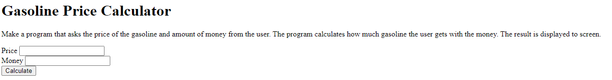

#Gasoline Calculator
Task was to create a project that calculated how much gasoline you can get with the amount of money you have.
This was a school project for learning purposes.

Technologies used
Built with:

HTML
JS
CSS

Setup and usage
Live page here

Screenshot

Authors and acknowledgment
Author: Emilia Vuorenmaa
GitHub: @emilia_jenni
Acknowledgement:
Margit Tennosaar
